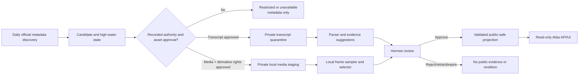

# PM synthesis — AI Engineer Insight Atlas daily Mac Mini transcript and media pipeline

**Status:** implementation-ready plan, no code or configuration activation in this change  
**Recommendation:** approve a two-lane pipeline. Retain daily official metadata discovery. Add transcript and keyframe processing only for a source with recorded rightsholder authority, explicit retention/derivative-use approval, private processing, and Hermes approval before public projection.  
**Confidence:** high for the control architecture; medium for the final provider/OAuth path because it needs rightsholder, legal, and security decisions.

## Delivery outcome and definition of done

Enable a daily Mac Mini pipeline for approved AI Engineer videos that:

1. discovers only official channel/uploads-playlist metadata at a low request rate;
2. lawfully acquires a transcript through an approved source, or records a safe unavailable/restricted state;
3. inspects an approved locally supplied media asset and proposes representative full-slide or picture-in-picture (PiP) frames;
4. keeps raw inputs and suggestions private; and
5. exposes only Hermes-approved, provenance-linked public-safe evidence and approved derivative frames through the existing last-known-good (LKG) projection.

Done means a three-video private pilot has passed the gates in this plan, including a rights decision per asset, repeatable private extraction, Hermes review, retraction, backup/restore, negative-path tests, and revision-bound run evidence. It does **not** mean that an API key, a metadata record, or a successful caption request grants a licence to retain or publish content.

## Confirmed facts and operating assumptions

| Type | Item | Treatment |
| --- | --- | --- |
| Fact | Existing discovery is the official YouTube uploads-playlist/API-key lane, with persisted incremental state, batching, 250 ms pacing, and no search/scraping loop. | Keep unchanged and metadata-only. |
| Fact | Caption access requires an authorised OAuth path; the existing API key is insufficient. | Make transcript access separately authorised and fail closed. |
| Fact | Hermes is canonical and Atlas must make zero unsupported display claims. | Hermes remains the sole public-evidence/keyframe publication authority. |
| Constraint | YouTube policies prohibit unauthorised downloading/caching/storing audiovisual content. | Never acquire YouTube stream/video through player capture, scrape, browser automation, or download tooling. |
| Assumption | The channel/rightsholder can provide an export or an approved local/provider media delivery path. | Validate in phase 0; without it, run metadata-only. |
| Assumption | The Mac Mini can run a dedicated local worker, encrypted storage, Keychain-protected credentials, and a pinned local FFmpeg. | Validate in the shadow run before daily media enablement. |

## Recommended architecture and authority boundary

### Authorised intake options

| Need | Permitted implementation path | Explicitly prohibited | Recommendation |
| --- | --- | --- | --- |
| Transcript | Rightsholder/channel-owner export; or an approved licensed provider; OAuth caption access only when the authorised content owner, exact Google Cloud project, scope, consent, retention and token model are approved. | Watch-page scrape, anonymous caption endpoints, browser automation, API-key caption access, personal/shared token bypass. | Start with rightsholder export. Consider OAuth after the pilot gate. |
| Video/media for frame processing | Rightsholder-supplied local/original asset or provider-sanctioned asset, with written permission to create, retain and, if desired, publish still derivatives. | YouTube stream download, player/iframe screenshots, yt-dlp-like tooling, stream recording, unauthorised caching. | Use local/rightsholder delivery only. |
| Public display | Hermes-approved paraphrase/evidence and only an explicitly approved derivative rendition. | Raw captions, raw video, unreviewed candidates, source paths, signed intake URLs, rights notes or credentials. | Existing LKG projection remains the public boundary. |

An OAuth grant proves technical access, not automatically permission to retain, transform, or redistribute content. The authority record must separately answer each of those rights.

## Logical components, owners, and contracts

| Component | Owner | Responsibility | Output / hard boundary |
| --- | --- | --- | --- |
| Discovery worker | Delivery Operations | Official uploads delta only; idempotent candidate state. | Acquisition request, never transcript/media automatically. |
| Rights control plane | Content owner + Legal/Security | Record source ownership, approved intake method, derivative/display rights, expiry and retention. | `SourceAuthorization`; absent/expired means blocked. |
| Private acquisition adapter | Operations | Import authorised transcript/media; hash and quarantine it. | Private encrypted object; no public mount. |
| Parser/analyser | Full-stack/Data | Normalise private captions; suggest evidence and frame candidates. | Non-authoritative suggestions only. |
| Local media worker | Full-stack + Operations | Bounded ffprobe/FFmpeg sampling and deterministic selection. | Private candidates and manifests only. |
| Hermes | Content owner | Review rights, claims, speaker eligibility, frames, alt text and retractions. | Signed approval/retraction envelope. |
| Projection builder/read API | Full-stack + Operations | Validate envelope and atomically publish LKG projection. | Public read-only approved fields only. |

### Required private records

`SourceAuthorization`: `authorizationId`, `videoId`, rightsholder, intake method, agreement/version reference, transcript permission, media-transform permission, public-rendition permission, attribution, retention class, effective/expiry dates, approver and status.

`TranscriptRevision`: `revisionId`, `videoId`, language, provider/source type, `authorizationId`, retrieval time, byte digest, source version, availability, recheck time, encrypted locator, parser status. Raw transcript segments remain private.

`MediaAsset`: `assetId`, `videoId`, `authorizationId`, original/preview classification, digest, local encrypted locator, dimensions/duration, supplied timestamp, derivative/display permissions, staging expiry and tool-readiness status.

`FrameCandidate`: `candidateId`, asset/revision digest, timestamp milliseconds, layout (`full_slide`, `picture_in_picture`, `unknown`), crop rectangles, scene/stability/text/face-area scores, perceptual hash, algorithm version, private-rendition locator and review status. Never include a face identity or biometric embedding.

`HermesPublicationEnvelope`: projection version, matching transcript/media digests, approved evidence identifiers, approved keyframe rendition IDs, public alt text/attribution, reviewer, approval time, retraction/supersession link and signature/version.

The public projection may contain approved `layout`, timestamp, rendition ID/URL, alt text and attribution. It must reject raw caption fields, private locators, non-current digests, missing authority, missing Hermes approval, or a retracted/expired asset.

## Media algorithm and privacy design

All analysis is local to the Mac Mini on an authorised asset. It does not upload frames or OCR output to a third party. Model/rule outputs are suggestions, never public claims.

1. **Preflight.** `ffprobe` validates a bounded local path, media type, duration, dimensions and size. Reject malformed, oversize, network-addressed or out-of-policy input before decoding.
2. **Candidate sampling.** Create low-resolution candidates at a two-second interval and at scene-change boundaries. Enforce fixed duration/file-size/output caps, one active FFmpeg process and no dynamic filter graph/network protocol. Start with a maximum of 12 review candidates per talk.
3. **De-duplicate.** Use perceptual hash and structural similarity (SSIM) to collapse near-identical frames; enforce at least ten seconds between accepted candidates unless a material scene change exists.
4. **Full-screen slide scoring.** Rank frames with high text/edge density, a dominant rectangular content region and stable layout for 1.5 seconds, penalising substantial face area. Initial private score: `0.35 text density + 0.25 rectangular layout + 0.25 stability - 0.15 face area`.
5. **PiP scoring.** Require both a slide-like main region and a persistent inset person/face area of about 1–20% of the frame, stable in position for 1.5 seconds. Otherwise classify `unknown` for human selection. Do not identify the speaker from the image.
6. **Renditions.** Preserve the full composite frame and an optional slide crop for review. Do not store a speaker-only crop by default; enable it only with explicit content/rightsholder approval. Do not create face embeddings or identity labels.
7. **Human review.** Hermes approves the timestamp, visible content, alt text, attribution, derivative-display right and public rendition. If none is approved, retain the standard source thumbnail/fallback and make no visual claim.

## Daily operating model, limits, and failure semantics

### Cadence and request controls

- Use `launchd` daily at an off-peak time, without `RunAtLoad`, under one supervisor lock. A concurrent trigger exits `already_running`; stale locks alert for manual inspection.
- Retain 250 ms minimum spacing, uploads-playlist enumeration, batched `videos.list` calls, persisted high-water state and no `search.list`. Conduct a full metadata reconciliation only weekly or by explicit manual approval.
- Daily discovery creates requests only for new/changed authorised candidates. At most one acquisition attempt per source revision in 24 hours; use idempotency key `(videoId, sourceVersion, digest)`.
- Retry only transient `429`/`5xx` provider failures with `Retry-After` and bounded 15-minute, one-hour and six-hour backoffs (maximum three attempts). Rights, scope, malformed content, hash/schema, policy and validation failures are terminal until manually changed.
- Begin with one video and one FFmpeg process in flight. Raise concurrency only with measured CPU, thermal, disk and recovery evidence.

### State transitions

`discovered -> authority_pending -> authorized | restricted | unavailable -> transcript_acquired / media_staged -> candidates_ready -> review_pending -> approved -> projected`

`failed_retriable`, `failed_final`, `stale`, `superseded`, `rejected`, `retracted`, and `expired` may occur at the relevant stage. Every non-approved state resolves to metadata-only public behaviour. Any digest, rights or approval change requires new review; it may not inherit approval.

## Security, privacy, storage and retention controls

- Separate the worker from the public web/API runtime. The public service has a read-only projection mount only and no OAuth/API/media/publishing credentials or private-store path.
- Use a dedicated non-admin Mac account; FileVault/encrypted application storage; private directories mode 700; configuration mode 600; Keychain-only secrets; private MFA-protected administration. No tokens in `.env`, images, launchd values, logs, URLs or browser variables.
- Use an authorised content-owner OAuth client and consented service/operator identity if the OAuth option is approved. Store only redacted token health in audit records. Missing/expired/insufficient scope is `authorization_blocked`, with no fallback.
- Treat captions, media metadata, OCR and any embedded instructions as untrusted content, not worker instructions. Do not include raw material in support bundles.
- Keep staging inputs and intermediate frames encrypted, unbacked-up, and delete after successful validation or expiry. Default raw transcript posture is locator/hash/minimal approved excerpt; retain encrypted payload only when the authority record permits it.
- Retain private candidate frames for no more than 90 days or until superseded; retain declined raw inputs 30 days unless a legal hold or approved policy says otherwise. Retain only approved public renditions and the current plus two LKG projections; retraction immediately creates a new projection and invalidates caches. Preserve redacted audit metadata for at least 90 days, subject to the approved compliance schedule.
- Back up state, audit records, approved derivatives and projection (never raw staging or Keychain secrets) to an encrypted approved organisational recipient. Run an isolated restore drill quarterly.

## Phased delivery plan and governance

| Phase | Target / exit criteria | Accountable owner | Forecast | Confidence |
| --- | --- | --- | --- | --- |
| 0. Authority and design gate | Signed rightsholder route chosen; legal/security approves transcript, derivative/public-rendition, retention, OAuth and incident rules; source allowlist and Hermes rubric approved. | PM; Content, Legal/Security | 1–2 weeks after owner engagement | Medium |
| 1. Metadata-only shadow | Daily discovery and request generation run for 14 days; locks, quotas, high-water state, disk/backup telemetry and no media calls validated. | Delivery Operations | 2 weeks | High |
| 2. Private transcript pilot | Three rightsholder-authorised transcripts imported; parser/schema/evidence review, deletion and retraction paths pass; no public mutation. | Full-stack + QA + Hermes | 1–2 weeks | Medium-high |
| 3. Private frame pilot | Three authorised media assets processed one at a time; slide/PiP/unknown selection reviewed; resource guardrails, privacy checks and rendition rights pass. | Full-stack + Operations + QA | 1–2 weeks | Medium |
| 4. Controlled projection pilot | At most two Hermes-approved public-safe evidence/frame outputs; signed projection, cache invalidation and retraction drill pass. | Hermes + Full-stack + QA | 1 week | Medium-high |
| 5. Daily pilot go/no-go | 14-day controlled daily run meets agreed quality, rights, operations and recovery gates. Expand only with measured capacity and support ownership. | PM + release approvers | 2 weeks | Medium |

**Governance:** Daily automated manifest review by Operations; weekly triage across PM, Content/Hermes, Full-stack, QA and Security; gate review at each phase exit. A P0 integrity/right breach freezes publication and reverts to the prior LKG projection. OAuth/right changes, public-frame policy, retention exceptions and concurrency increases require Security/Legal/Content approval.

## Validation and release gates

| Gate | Evidence required | Exit owner |
| --- | --- | --- |
| Authority | Per-video authority record; written transcript/media/derivative/display terms; approved OAuth/provider configuration if used. | Content + Legal/Security |
| Functional | Deterministic private transcript/video fixtures; schema, state-transition, idempotency and projection rejection tests. | Full-stack + QA |
| Media quality | Full-slide, PiP and unknown cases show bounded candidates, duplicate suppression, correct timestamps and reviewed alt text. | QA + Hermes |
| Security/privacy | Token/non-public asset scan, fail-closed auth test, no third-party analysis egress, no face identity storage, ACL/Keychain review. | Security |
| Operational | One-item dry run, pinned tool version, timeout/quarantine, quotas, thermal/disk guardrails, redacted audit and alert tests. | Delivery Operations |
| Recovery | Encrypted off-host backup and isolated restoration of state/audit/approved derivatives/projection. | Operations + QA |
| Publication | Hermes approval, matching hashes/rights, atomic LKG replacement, read-only API and retraction/cache invalidation drill. | Hermes + QA + PM |

## RAID summary

| ID | Type | Description | Owner | Rating | Mitigation / trigger |
| --- | --- | --- | --- | --- | --- |
| R1 | Risk | Authority to retrieve does not cover retention, transformations or publication. | Legal + Content | High | Require separate authority fields; block asset absent approval. |
| R2 | Risk | Raw captions, media or candidates leak to public/API/log/backup. | Security + Full-stack | High | Separate mounts, validation deny-list, redacted logging, private-store scan. |
| R3 | Risk | PiP frames expose a speaker beyond intended purpose/privacy. | Content + Security | High | No speaker crop/identity by default; human rendition review. |
| R4 | Risk | Mac Mini disk, heat, power or network causes partial processing/loss. | Operations | Medium-high | Single worker, guardrails, UPS, LKG, encrypted off-host restore. |
| R5 | Risk | Quota/provider change causes unreliable daily run. | Operations | Medium | Incremental discovery, pacing, bounded retries, manual full reconciliation. |
| R6 | Risk | Stale/retracted source continues to display. | Hermes + Full-stack | High | Digest/expiry checks, versioned approval, cache invalidation/retraction drill. |
| I1 | Issue | There is no evidenced production transcript/media authority yet. | PM | High | Resolve phase-0 decision before implementation. |
| D1 | Dependency | Rightsholder owner, approved source exports/assets, agreement terms and review capacity. | Content owner | High | Secure named owner and three-pilot asset package. |
| D2 | Dependency | OAuth client/scope approval if the official caption path is selected. | Security + Legal | High | Do not scope/build until legal approval. |
| D3 | Dependency | Encrypted backup recipient, Mac Mini operational owner, FFmpeg provenance and fixture corpus. | Operations + QA | Medium | Establish before shadow/pilot enablement. |

## Stakeholder decisions requiring approval

| Decision Point | Options | Recommendation | Confidence | Impact If Wrong | Owner Needed |
| --- | --- | --- | --- | --- | --- |
| Initial transcript authority | Rightsholder export; authorised YouTube OAuth; licensed vendor; public extraction | Rightsholder export pilot; OAuth only post-approval; public extraction rejected. | High | Copyright/terms breach or no lawful corpus | Content + Legal + Security |
| Media input/right | Owner-supplied local/provider asset; YouTube capture/download | Use owner/provider asset with written transform and public-still rights; reject capture/download. | High | Prohibited media handling, public rights breach | Content + Legal + Security |
| OAuth model | Approved channel-owner/service operator OAuth; personal token; API key | Only approved content-owner OAuth with minimum approved scopes; API key stays metadata-only. | High | Credential/consent breach and pipeline outage | Security + Legal + Content |
| Speaker/PiP policy | Full composite + slide crop; speaker crop/identification | Default to composite/slide crop only; no identity or speaker crop without explicit approval. | High | Privacy and likeness misuse | Content + Security |
| Retention | Locator/hash only; 30/90-day encrypted raw; indefinite corpus | Locator/hash by default; 30-day declined raw and 90-day private candidates, subject to written policy/legal hold. | Medium | Rights/privacy exposure or review loss | Legal + Security + Content |
| Public keyframes | Automatic candidates; Hermes-approved renditions; no frames | Hermes-approved renditions only, with metadata fallback when none is approved. | High | Unsupported/unlicensed visual claim | Hermes + Product + Security |
| Pilot scale | Parallel daily processing; one asset/FFmpeg | One asset/FFmpeg until 14-day capacity/recovery evidence. | High | Thermal/disk loss and opaque failures | Operations + QA |

## Next actions

1. PM schedules phase-0 authority meeting with Content/rightsholder, Legal and Security and assigns one decision owner per row above.
2. Content/rightsholder supplies three pilot videos, export/media options, agreement references and desired public-rendition policy.
3. Security approves/refuses OAuth route, token custodian, scope, Keychain access and retention class; it must not be assumed from technical API access.
4. Delivery Operations prepares the Mac Mini shadow-run checklist, encrypted backup recipient, monitoring thresholds and restore environment.
5. Full-stack and QA turn the contracts and gates into an implementation backlog only after phase-0 approval.

## Activated specialist handoffs

- `solution-architecture-daily-media-pipeline-handoff.md`: local-first architecture, private/public contract, frame algorithms, data lifecycle and rollout design.
- `delivery-operations-daily-media-pipeline-handoff.md`: Mac Mini scheduling, secret/storage controls, FFmpeg guardrails, operations runbook and recovery gates.

The PM synthesis adds the compliance control interpretation and governance decision gates. No code, credentials, schedules, source configuration or production data were changed.
