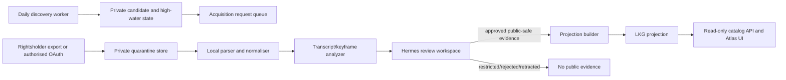

# Solution architecture handoff: daily Mac Mini transcript and keyframe pipeline

## Task summary

Defined an implementation-ready, local-first daily pipeline for approved AI Engineer video sources. It discovers metadata with the existing low-request worker, acquires transcripts only through a lawful authorised path, derives reviewer-visible themes and keyframes, and publishes only Hermes-approved, public-safe evidence to the existing versioned last-known-good (LKG) projection.

## Recommended path

Use a two-stage pipeline: daily metadata discovery and acquisition preparation; then a separately authorised, review-gated media processing job. Treat a transcript as private working material. Hermes is canonical for review, rights, speaker eligibility, evidence approval, retraction, and publication. The public API receives no raw transcript, keyframe source media, signed URLs, credentials, or private reviewer notes.

### Lawful transcript acquisition options

| Option | Rights/technical position | Pros | Risks | Decision |
| --- | --- | --- | --- | --- |
| Channel-owner export or direct rightsholder delivery | Obtain captions/transcript from source owner under recorded terms | Clearest rights and provenance; no API scrape | Operational coordination | Preferred pilot and production default |
| YouTube Data API captions with rightsholder OAuth | `captions.list`/`captions.download` require authorised OAuth and permissions for the video/caption track | Official route; auditable scopes | Token lifecycle, consent, terms and quota | Use only after legal/security approval |
| Licensed transcript vendor with written rights | Contractual provider API and source linkage | May reduce manual work | Redistributability and source fidelity vary | Conditional option after procurement review |
| Public watch-page scraping, anonymous caption endpoints, browser automation | No approved source/rightsholder contract | Superficially easy | Terms, availability, provenance, and rate-limit risk | Prohibited |

Recommendation: start with channel-owner/direct exports on a small approved pilot. Add OAuth only when a content owner, legal, and security approve the exact Google Cloud project, scopes, retention, consent, and token-owner model. A YouTube data API key remains metadata-only and must never be represented as caption access.

## Target architecture



### Components and ownership

| Component | Responsibility | Input/output | Owner |
| --- | --- | --- | --- |
| Discovery worker | Official metadata-only uploads delta | approved playlist -> private candidates/state | Delivery Operations |
| Acquisition request queue | Records requested source, authority, due/retry state; does not fetch by default | candidate -> request | Content operations |
| Authorised acquisition adapter | Imports owner export or OAuth caption download | approved source -> encrypted quarantine object | Operations + Security |
| Parser/normaliser | Validates format, hashes exact bytes, normalises timestamps/language; rejects malformed data | private artifact -> immutable transcript revision | Full-stack |
| Analyzer | Produces suggested themes and keyframe candidates only | transcript/video -> review suggestions | Full-stack/Data |
| Hermes review | Validates rights, approved paraphrase, speaker eligibility, evidence/keyframe selection | private record -> approved/retracted envelope | Content owner |
| Projection builder | Validates exact public schema and atomically publishes public-safe projection | Hermes envelope -> LKG projection | Full-stack/Ops |
| Public reader | Serves only current public-safe projection | projection -> API/UI | Web runtime |

## Contracts and data lifecycle

### Private acquisition/revision record

`TranscriptRevision` is immutable: `revisionId`, `videoId`, `sourceUrl`, `provider`, `sourceType`, `authorityRef`, `retrievedAt`, `locale`, `sourceVersion`, `sha256`, `acquisitionRunId`, `availability`, `termsBasis`, `rightsBasis`, `redistributionAllowed`, `attributionRequired`, `expiry/recheckAt`, encrypted object location, and parser status. Store raw caption segments only here.

`AnalysisSuggestion` is private and non-authoritative: `revisionId`, model/rule version, theme candidates plus matching locators, candidate evidence locators, keyframe candidates, and confidence. Do not publish it or treat confidence as approval.

`HermesEvidenceApproval` is the publishable review envelope: `evidenceId`, `videoId`, `revisionId`, digest, public-safe approved paraphrase/excerpt policy result, timestamp start/end, evidence status, reviewer/version/time, optional explicit speaker identity plus eligibility, and retraction/supersession linkage.

### Public projection mapping

| Public field | Source | Rule |
| --- | --- | --- |
| `themes` and `themeClassification` | Hermes-approved taxonomy decision | Existing closed vocabulary only; zero-to-many; never speaker evidence |
| Transcript summary/provenance | `TranscriptRevision` and rights review | Public-safe provider/source/times/digest/status only; no private path/token/raw text |
| Evidence text/timestamp/speaker | `HermesEvidenceApproval` | Include only current approved evidence matching video and digest; speaker only with explicit eligible flag |
| Keyframe reference | Hermes approval plus derived/public image rendition | Store public rendition ID, timestamp, algorithm/version; never source upload path |
| Manifest/hash/LKG | Projection builder | Fingerprint themes, evidence statuses/locators/digests and keyframe IDs; atomic replacement only |

## Low-request daily state and rate policy

- Retain the existing uploads-playlist high-water mark, 50-item pages/batches, no `search.list`, 250 ms minimum request spacing, bounded retry only for `429`/`5xx`, and one atomic directory lock.
- Daily discovery creates acquisition requests only for newly approved candidates. It must not invoke transcript/keyframe processing automatically merely because metadata exists.
- Per source: at most one acquisition attempt per revision per 24 hours; retry transient errors with 15 min, 1 hr, then 6 hr delays; stop after three attempts and require reviewer action.
- OAuth adapter: hard per-run item cap, token bucket below documented quota, no parallel downloads for the same video, stop on scope/403/rights error, and record only redacted error class.
- Persist `latest successful revision`, digest, availability/recheck expiry, request idempotency key `(videoId, sourceVersion, digest)`, and an append-only audit event. A changed digest creates a new review requirement and cannot inherit approval.

## Keyframe design

### Candidate generation

Use local decoded video only when its storage/rights permit derivative analysis. Sample a coarse stream every 2 seconds, then add candidates at detected scene boundaries. Use perceptual hash plus structural similarity (SSIM) to collapse near-duplicates, enforce a 10-second temporal separation, and select a bounded set (for example 12 candidates per talk). Never upload frames to a third-party analysis service without separate approval.

### Full-slide classifier

For each candidate, detect a slide using: high edge/text density, low face area, dominant rectangular content region, and stable frame-to-frame layout for at least 1.5 seconds. OCR is local-only and is used only for duplicate/layout scoring unless rights approve text extraction. Score: `0.35*text_density + 0.25*rectangular_layout + 0.25*stability - 0.15*face_area`; send the top score per scene to review. Preserve algorithm/version, source timestamp, phash, and confidence privately.

### Picture-in-picture classifier

Detect a persistent small face/person region over a slide region. Require a face/person area between 1% and 20% of frame area, a large slide-like background, and stable inset location across at least 1.5 seconds. Classify as `picture_in_picture` only when both slide and inset signals pass thresholds; otherwise label `unknown` for reviewer selection. Do not infer speaker identity from the face.

### Keyframe publication rule

Candidate keyframes are not public. Hermes must approve the timestamp, rendition rights, caption/alt-text, and whether a public derivative may be stored. Public card/modal use only approved renditions; if no keyframe passes review, use existing standard thumbnail/source fallback.

## Storage, retention, security, and failure state

- Private state root: encrypted volume/application-support directory, mode-700 directory, mode-600 configuration, dedicated non-admin operator; credentials in Keychain only.
- Quarantine raw media/transcripts: encrypt at rest, strict local service account ACL, no browser/container read mount, no support-bundle inclusion. Retain 30 days after a declined request and for the approved legal/review retention period otherwise; deletion records retain digest, authority reference, and audit metadata only.
- Derived private suggestions/keyframe candidates: retain 90 days or until superseded review; purge with their revision unless a legal hold applies.
- Public projections/renditions: retain current and last two approved LKG versions; retraction produces a new projection immediately and invalidates public caches. Keep evidence audit metadata per compliance retention policy.
- Failure states: `not_requested`, `requested`, `acquired`, `unavailable`, `restricted`, `failed_retriable`, `failed_final`, `stale`, `superseded`, `review_pending`, `approved`, `retracted`. The public UI maps every non-approved state to safe metadata-only copy without differential acquisition detail.

## API and job contracts

All write/job interfaces are private local commands or Hermes authenticated APIs; do not expose them through the Atlas read API.

```ts
type AcquisitionRequest = {
  requestId: string; videoId: string; sourceUrl: string;
  authority: "owner_export" | "youtube_oauth" | "licensed_provider";
  idempotencyKey: string; status: "requested" | "blocked" | "complete" | "failed";
};
type KeyframeCandidate = {
  revisionId: string; timestampSeconds: number;
  kind: "full_slide" | "picture_in_picture" | "unknown";
  algorithmVersion: string; score: number; phash: string;
};
type HermesPublicationEnvelope = {
  projectionVersion: string; approvals: readonly HermesEvidenceApproval[];
  approvedKeyframes: readonly ApprovedKeyframe[]; signedBy: string;
};
```

The existing public GET catalog/manifest/video endpoints remain read-only and LKG-backed. They must reject any projection with raw transcript fields, private URLs, non-current evidence, missing digest, missing rights decision, or unapproved keyframe rendition.

## Rollout and acceptance

1. **Offline fixtures:** deterministic private fixture transcripts/videos, parser and classifier unit tests, fail-closed projection tests; no external call.
2. **Owner-export pilot:** three explicitly authorised talks; manual review of every evidence and keyframe; verify deletion and retraction paths.
3. **Mac Mini shadow run:** daily discovery plus private request generation only for 14 days; validate locks, rate limits, disk, backups, restore, Keychain session behaviour, and audit completeness.
4. **Public-safe projection pilot:** publish only two Hermes-approved paraphrases and approved keyframes; short cache TTL and retraction drill.
5. **OAuth decision gate:** proceed only after rights, scopes, consent owner, token rotation, security review, and quota/rate evidence are approved.

## Key facts, assumptions, and caveats

- Existing operations already separates discovery from public publication, uses a Mac Mini `launchd` worker, Keychain secret storage, atomic locks, LKG projection fallback, and a private state directory.
- No current live transcript/caption access or production corpus is evidenced. This architecture does not assert it exists.
- Single-Mac-Mini availability is a non-HA risk; power, disk, user session, and local hardware failure need an encrypted restore path, not automatic public failover.

## Handoffs and validation

| Team | Required next action |
| --- | --- |
| Product/Content | Choose source authority and approve evidence/keyframe review rubric |
| Legal/Security | Approve rights model, retention, OAuth scopes/tokens, derivative-frame policy, and incident process |
| Full-stack | Implement private parser/analyser interfaces and fail-closed projection validation against fixtures |
| Delivery Operations | Provision encrypted state, launchd schedules/locks, backup/restore drill, alerts, and key management |
| QA | Build fixture-based parser/classifier/projection/retraction tests and execute visual/a11y evidence paths |

## Decision points

| Decision Point | Options | Recommendation | Confidence | Impact If Wrong | Owner Needed |
| --- | --- | --- | --- | --- | --- |
| Initial transcript authority | Owner export; OAuth; vendor | Owner export pilot | High | Terms/rights breach | Content + Legal |
| Raw retention duration | 7/30/90 days | 30 days unless approved review/legal retention requires longer | Medium | Privacy/cost or review loss | Legal + Security |
| OCR/keyframe handling | Local only; cloud vision | Local only in pilot | High | Rights/data egress breach | Security + Legal |
| Public keyframes | Publish candidates automatically; Hermes approval | Hermes approval required | High | Unlicensed/incorrect visual claim | Content owner |
| OAuth rollout | Immediate; post-pilot gate | Post-pilot gate | High | Token/consent/quota failure | PM + Security |
